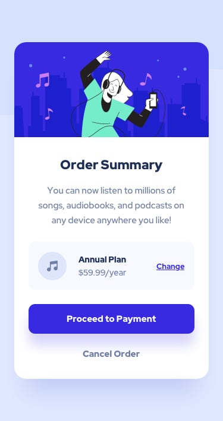

# Frontend Mentor - Four card feature section solution

This is a solution to the [Four card feature section challenge on Frontend Mentor](https://www.frontendmentor.io/challenges/four-card-feature-section-weK1eFYK). Frontend Mentor challenges help you improve your coding skills by building realistic projects.

## Table of contents

- [Overview](#overview)
  - [The challenge](#the-challenge)
  - [Screenshot](#screenshot)
  - [Links](#links)
- [My process](#my-process)
  - [Built with](#built-with)
  - [What I learned](#what-i-learned)
  - [Continued development](#continued-development)
- [Author](#author)
- [Acknowledgments](#acknowledgments)

## Overview

### The challenge

Users should be able to:

- View the optimal layout for the site depending on their device's screen size

### Screenshot

### Links

- Live Site URL: [Add live site URL here](https://four-card-feature-section-seven.vercel.app/)

## My process

### Built with

- Semantic HTML5 markup
- CSS custom properties
- Flexbox
- CSS Grid
- Mobile-first workflow

### What I learned

In this project, I focused on centering elements cleanly in the viewport, grid the the disign for the desktop view and make it responsive for different type of screen, clean CSS properties

### Continued development

- **CSS Grid & Advanced Layouts:** Expanding beyond Flexbox to build more complex, multi-column web layouts.
- **Accessibility (a11y):** Ensuring proper ARIA attributes, focus states, and semantic landmarks for screen reader compatibility.
- **CSS Custom Properties & Design Tokens:** Organizing color palettes, typography scales, and spacing units dynamically using root CSS variables.
- **Mobile Responsive Design:** Fine-tuning media queries to ensure seamless scaling across various screen resolutions.

## Author

- Frontend Mentor - [@FEMII_DEV](https://www.frontendmentor.io/profile/FEMII_DEV)
- Twitter - [@femii_dev](https://www.twitter.com/femii_dev)

## Acknowledgments

- **[Frontend Mentor](https://www.frontendmentor.io)** - Thanks to Frontend Mentor for providing this fun component challenge to practice layout and responsive design.
- **[MDN Web Docs - Flexbox Guide](https://developer.mozilla.org/en-US/docs/Learn/CSS/CSS_layout/Flexbox)** - Great reference for understanding alignment and flex properties.
- **[codeliber](https://codeliber.com/)** - Thanks to codeliber for the free tutorial apps to learn learn HTML, CSS and some other coding languages.
